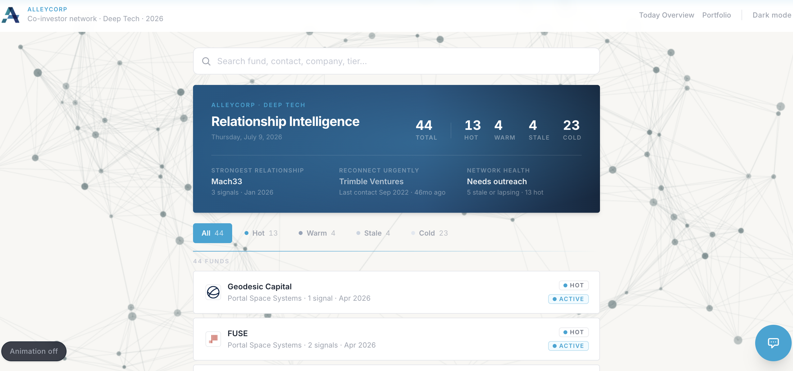
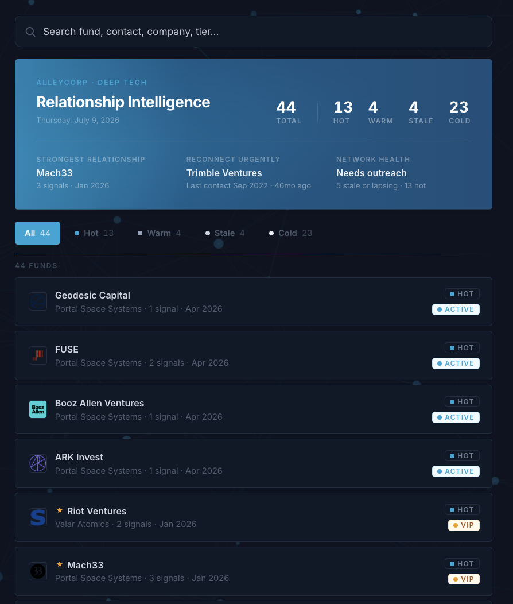
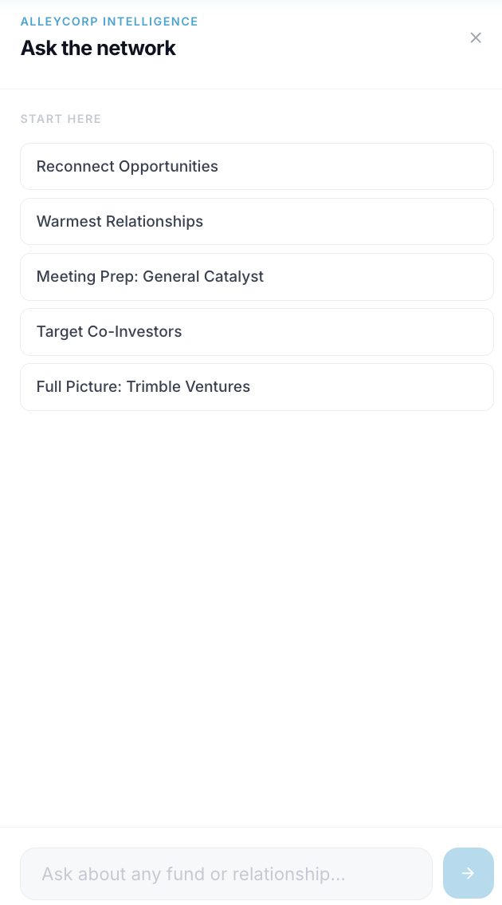
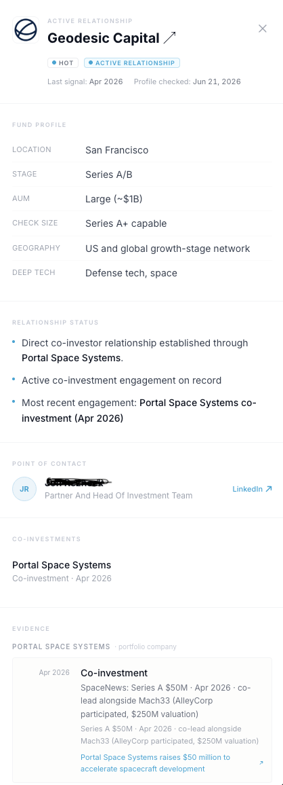

# Relationship Intelligence

> Built for a real early-stage venture capital firm — not a demo, it ran on live data and a live network.


---

## The Idea

VCs lose track of their best relationships the same way anyone loses track of a friendship — quietly, with no single moment where it "went cold." By the time someone notices a co-investor has drifted, the window to re-engage has usually closed.

It watches a firm's co-investor network, scores every relationship by warmth, and surfaces the ones drifting out of reach — before that window closes.

This isn't a class project sitting in a repo — it ran in production, tracking a real network for a real early-stage VC firm's investment team.

Built for venture capital, but the underlying idea isn't VC-specific — any team managing a network that quietly goes stale if ignored (sales pipelines, partnerships, alumni relations) could run on the same approach: score relationship health from real signals, and surface who needs attention before it's too late.

---

## What It Does

- **Scores every relationship** Hot / Warm / Stale / Cold, based on real signals — not a guess
- **Scans the web daily** for new co-investment activity using AI-powered search, and turns what it finds into structured data automatically
- **Answers questions in plain English** — "which co-investors should we reconnect with?" — backed by the live database, not a generic AI summary
- **Shows its work** — every warmth score links back to the specific signals that produced it, so nothing is a black box
- **Flags relationships going quiet** before they've fully gone cold

---

## Screenshots

**Dashboard** — every relationship at a glance, light and dark mode




**Ask the Network** — natural language queries over live relationship data



**Investor Profile** — every score traceable to real, sourced evidence



---

## How It Works

```
Web search (Exa AI)
      ↓
Claude reads results → returns structured, schema-checked data (no free text, no hallucinated facts)
      ↓
PostgreSQL — deduplicated automatically
      ↓
Warmth scoring engine — deterministic, auditable, explainable
      ↓
Dashboard + natural-language chat (Claude, via MCP)
```

The scoring itself is plain code, not AI — weights, recency, and patterns, fully explainable and overridable. AI is used where it's strong (reading the web, understanding a question) and kept out of where it shouldn't be trusted blindly (deciding who's a hot lead).

---

## Tech Stack

Next.js 15 · TypeScript · PostgreSQL · Tailwind CSS · Anthropic Claude (tool use + MCP server) · Exa AI · GitHub Actions · Vitest

---

## Run It Locally

No database needed — it runs on realistic demo data out of the box.

```bash
npm install
npm run dev
```

Open [http://localhost:3000](http://localhost:3000). To connect a real database instead, copy `.env.example` to `.env` and set `DATABASE_URL`.

```bash
npm run test:unit    # scoring engine, no DB required
```

---

## Built By

A three-person team — Luba, Michael, and Yaasameen — over an eight-week sprint: data pipeline and AI signal ingestion, warmth scoring engine, and frontend/chat experience.
